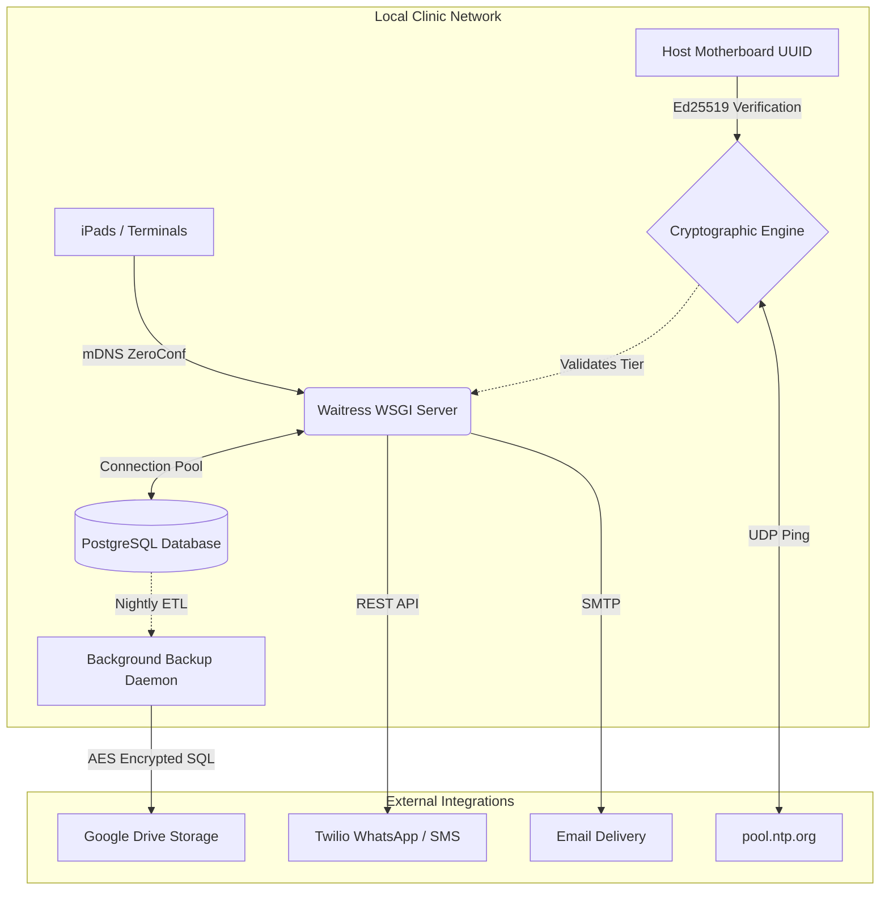

# 🐾 TriVet: Enterprise-Grade Offline-First Veterinary ERP & Autonomous CRM

**[ 🔗 Watch the Clinic Director's Endorsement ](https://youtube.com/shorts/YXOO-PCw0xQ?feature=share)**

---

## 📌 Executive Summary
**TriVet** is a proprietary, **offline-first** Enterprise Resource Planning (ERP) and Shop Management System (SMS) engineered specifically for high-volume veterinary hospitals operating in regions with unstable internet infrastructure. It is not a standard web application; it is a **compiled, highly secure on-premise SaaS appliance.**

The system completely digitizes clinical workflows, manages fractional **dual-currency (IQD/USD) inventory**, and actively drives recurring revenue via an autonomous **WhatsApp CRM engine**. To  enforce a B2B subscription model without relying on cloud licensing servers, the Python/Flask backend is compiled to native C binaries via Cython. It is secured by an advanced Ed25519 Asymmetric Cryptographic DRM engine featuring hardware-UUID binding and NTP-validated temporal tamper protection.

---

## 📈 Live Market Data (15-Month Pilot Study)

Before commercial release, TriVet operated silently in a high-volume clinic in Sulaymaniyah, Iraq to gather unbiased performance data and validate its architecture:

* Processed 5,616 paying transactions flawlessly using the offline-first dual-currency POS.

* Tracked 6,309,520 IQD in Revenue Leakage: The system autonomously identified 280 "No-Show" appointments, giving clinic ownership complete visibility into evaporated revenue and mitigating future losses via the WhatsApp CRM.

* Eliminated "Room Service" Shrinkage: Successfully deployed the Financial Interceptor, autonomously capturing unbilled medical procedures performed on boarded pets and routing them to the correct checkout folio.
    
---

## 📸 System Interface & Visual Tour

  
<strong>Admin Dashboard View</strong>

  <!-- Use the VIDEO tag for the MP4s -->
  <video src="https://github.com/user-attachments/assets/a29d604b-aa72-4c5d-be82-faf599ddcdad" width="800" autoplay loop muted playsinline></video>
  
    

  
<strong>Clinical Medical Visits and Report Generation</strong>

  <video src="https://github.com/user-attachments/assets/c60e629f-daa7-40e3-957c-7636e09c7ccc" width="800" autoplay loop muted playsinline></video>
  
    

  
<strong>Checkout POS</strong>

  <video src="https://github.com/user-attachments/assets/f01f4eed-327a-4104-90e8-dd8a3034cacb" width="800" autoplay loop muted playsinline></video>

    
  
<strong>Inpatient Folio, Hotel Tasks and Services</strong>

  <!-- Keep this as an img tag since it's just a picture -->
  

---

## 📊 System Impact & Business Value
* 📈 **Autonomous Revenue Generation:** Engineered a background cron engine that automatically dispatches localized *(Arabic / Kurdish / English)* WhatsApp vaccine recalls, directly converting patient data into recurring clinic revenue.
* ⚡ **100% Operational Uptime:** Deployed directly on local hardware. The system is immune to regional ISP outages, utilizing **ZeroConf (mDNS)** multicast routing to broadcast the application to internal clinic iPads and terminals.
* 🔒 **Zero-Leakage Financials:** Processed thousands of transactions with absolute mathematical precision utilizing a dual-currency Point-of-Sale (POS). Features historical Cost of Goods Sold (COGS) tracking and strict shift-based cash drawer management to eliminate financial shrinkage.

---

## 🛠️ Tech Stack & Architecture

* **Backend / API:** `Python 3`, `Flask`, `Waitress WSGI`, `APScheduler` *(Background Tasks)*
* **Database Engine:** `PostgreSQL 16` *(Thick DB Architecture)*
* **Frontend:** Server-Side Rendered `HTML5`/`CSS3`, `Vanilla JS`, `Bootstrap`, `SweetAlert2`
* **Security & Cryptography:** `Cython` *(Source Code Obfuscation)*, `Ed25519 Asymmetric PEM`, `Fernet (AES-128)`, `pbkdf2:sha256`
* **External APIs:** `Twilio` *(WhatsApp/SMS)*, `SMTP` *(Email)*, `Google Drive` *(Cloud Backups)*
* **DevOps & Testing:** `PyInstaller`, `InnoSetup`, `pytest`, `Playwright`

---

## ⚙️ Core Engineering Achievements

### 1. 🛡️ Asymmetric Cryptographic DRM & Anti-Piracy Engine
To protect intellectual property and enforce a strict SaaS tier model *(CORE, PRO, ENTERPRISE)* in an **offline environment**, I built a military-grade Digital Rights Management (DRM) solution:
* **Hardware Fingerprinting:** Dynamically queries the host machine's BIOS to extract a composite `Motherboard/MAC UUID`, permanently binding the software to the physical server.
* **Ed25519 Cryptography & RAM-Baking:** Subscription payloads are privately signed via a master `private_key.pem`. The client software verifies the signature mathematically. To prevent UI tampering, all HTML templates are packed into Base64 strings and **loaded directly into RAM** (`compiled_ui.py`) at runtime.
* **NTP Temporal Lockout:** The system queries `pool.ntp.org` to validate the OS clock. If a user attempts to wind their Windows clock backward to extend their license, the system detects the temporal anomaly and immediately triggers a **cryptographic lockdown**.

### 2. 🗄️ "Thick DB" Architecture & Idempotent Migrations
The PostgreSQL schema is engineered to handle heavy business logic, keeping the Python API exceptionally fast and transactional:
* **Autonomous Bootstrapping:** The application features a custom, sequential migration engine (`V1` to `V21`). On a fresh install, the executable autonomously connects to Postgres, builds the database, injects **25+ relational tables**, builds `PL/pgSQL` triggers, and applies strict constraints.
* **Smart Soft-Deletes:** Designed unique table indexes that allow for the "soft-deletion" of customer records while automatically freeing up unique constraints (like Emails and Phone Numbers) for future re-use, preventing database collisions.

### 3. 💵 Forensic Accounting & Dual-Currency POS
Engineered a financial module designed to operate flawlessly in the Middle Eastern market:
* **Dynamic IQD/USD Ledger:** The Point-of-Sale tracks inventory purchases in USD but dynamically converts to Iraqi Dinar (IQD) at the register based on real-time exchange rates, automatically calculating **exact net-profit margins**.
* **Anti-Embezzlement Audit Trails:** Built a robust `JSONB`-powered `audit_logs` table. Every voided receipt, manual inventory adjustment, and clinical note edit is permanently stamped with the user's ID. Clinical note edits feature a strict **24-hour grace period** before triggering immutable forensic revisions.
* **Advanced Debt Management:** Allows for partial installment payments on open invoices, automatically prioritizing and fulfilling the oldest historical debts first.

### 4. 🤖 Autonomous CRM & Clinical Automation
Transformed the software from a static database into an active business partner:
* **Background Task Scheduler:** Integrated `APScheduler` to run autonomous Python threads in the background without blocking the Waitress WSGI web server.
* **Multi-Lingual Twilio Integration:** The system automatically sweeps the database every morning to identify upcoming appointments and expiring vaccines, dispatching personalized WhatsApp messages. Includes **hard-cap safety limits** to prevent API billing overages.
* **Checkout Pipeline:** When a veterinarian finalizes a medical visit, all administered procedures and medications are automatically pushed to the front-desk POS **"Waiting List"**, eliminating double-entry and dropped charges.

### 5. 🌩️ Automated Disaster Recovery & Data Sovereignty
To mitigate local hardware failure risks (e.g., SSD corruption or Ransomware):
* **AES-Encrypted Backups:** A nightly thread executes a `pg_dump` subprocess, compresses the SQL data, **encrypts it using Fernet (AES-128)**, and stores it locally. 
* **ETL Cloud Sync:** Dynamically generates structured, plaintext `.txt` medical reports and mirrors them to a localized Google Drive hierarchy (e.g., `Records/PatientName_ID`), ensuring veterinarians retain readable access to patient histories even if the database is destroyed.
* **Cryptographic "Time Machine":** Built a 1-click database restoration panel in the Admin Dashboard. Rollbacks require a **single-use, 15-minute expiring Vendor Override Key** to execute, preventing unauthorized staff from wiping daily sales data.

---

## 🗺️ System Architecture Topology

--- 

## 📫 Let's Connect

TriVet represents my ability to take a complex business problem and engineer a secure, scalable, and beautiful full-stack solution from scratch.

    Looking to hire a Senior Backend / Full-Stack Engineer? Let's talk.

    Want to deploy TriVet in your clinic? Reach out for a demo.

Email: AlandDiary@outlook.com

> **© 2026 TriTakion. All Rights Reserved.**  
> *The architectural documentation, system diagrams, and media assets presented in this repository are the intellectual property of the author. They may not be copied, reproduced, or used without express permission.*

